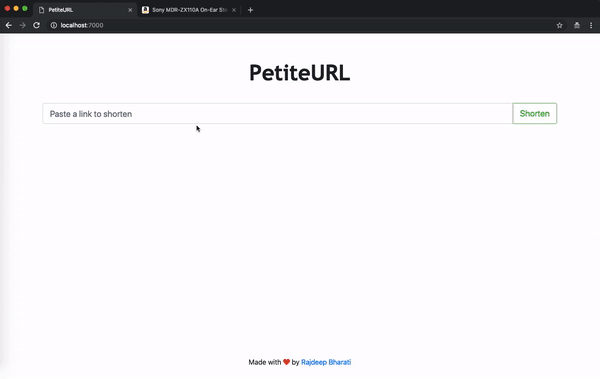

# PetiteURL

A URL shortening service in Node.js

### Demo



### Getting Started

```
$ npm install
```

Create a file `.env` and specify environment variable(s)

Start a MongoDB instance:

```
$ sudo mongod
```

For example:
`DATABASE=mongodb://localhost:27017`

Run in development environment:

```
$ npm run dev
```

Run in production environment:

```
$ npm run start
```
